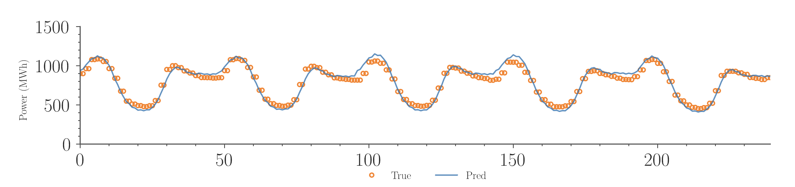

# mlpForecaster(MLPF)

**MLPF** is a simple and efficient architecture for providing point and probabilistic forecasting. The architecture has been designed to minimize model complexity while improving forecasting performance.

## Table of Contents
- [mlpForecaster(MLPF)](#mlpforecastermlpf)
  - [Table of Contents](#table-of-contents)
  - [Installation](#installation)
  - [Usage](#usage)
  - [Features](#features)
  - [Examples](#examples)
  - [Contributing](#contributing)
  - [License](#license)
  - [Contributors](#contributors)
  - [References](#references)

## Installation

You can install the `mlpForecaster` via pip:

```bash
pip install mlpforecaster
```

## Usage

```python
from mlpforecast.forecaster.mlp import MLPForecast

model = MLPForecast(exp_name='test', model_type="MLPF", hparams=model_hparams)

model.fit(train_data)
out=model.predict(test_data)

```
## Features
- **Point Forecasting**: Generate accurate single-point predictions for your time series data, ensuring precise future estimates.
  

- **Low Model Complexity**: Benefit from a design focused on minimizing complexity while maintaining high performance and accuracy, making it easier to deploy and maintain.

- **Hyperparameter Optimization**: Automatically optimize hyperparameters using the Optuna library, enhancing model performance and reducing manual tuning efforts.

- **Recursive Forecasting**: Achieve any desired forecast length by leveraging recursive forecasting techniques, which extend predictions iteratively over time.

## Examples

You can find more examples and detailed usage in the [examples directory](https://github.com/sambaiga/mlpforecast/blob/main/example/).

## Contributing

We welcome contributions! Please see our [CONTRIBUTING](CONTRIBUTING.md) guide for more details.

## License

This project is licensed under the MIT License - see the [LICENSE](LICENSE) file for details.

## Contributors

Thanks goes to these wonderful people ([emoji key](https://allcontributors.org/docs/en/emoji-key)):
<!-- ALL-CONTRIBUTORS-LIST:START - Do not remove or modify this section -->
<!-- prettier-ignore-start -->
<!-- markdownlint-disable -->
<table>
  <tbody>
    <tr>
      <td align="center" valign="top" width="14.28%"><a href="https://github.com/sambaiga"><br /><sub><b>Sambaiga</b></sub></a><br /><a href="https://github.com/sambaiga/MLPF/commits?author=sambaiga" title="Code">💻</a> <a href="#maintenance-sambaiga" title="Maintenance">🚧</a></td>
      <td align="center" valign="top" width="14.28%"><a href="https://github.com/fred-apina"><br /><sub><b>Apina</b></sub></a><br /><a href="https://github.com/sambaiga/MLPF/commits?author=fred-apina" title="Code">💻</a> <a href="#maintenance-fred-apina" title="Maintenance">🚧</a></td>
    </tr>
  </tbody>
</table>

## References

This work is inspired by the research from the following publication:

A. Faustine, N. J. Nunes and L. Pereira, "Efficiency through Simplicity: MLP-based Approach for Net-Load Forecasting with Uncertainty Estimates in Low-Voltage Distribution Networks," in IEEE Transactions on Power Systems, doi: [10.1109/TPWRS.2024.3400123](https://ieeexplore-ieee-org.tudublin.idm.oclc.org/document/10529636).

<!-- markdownlint-restore -->
